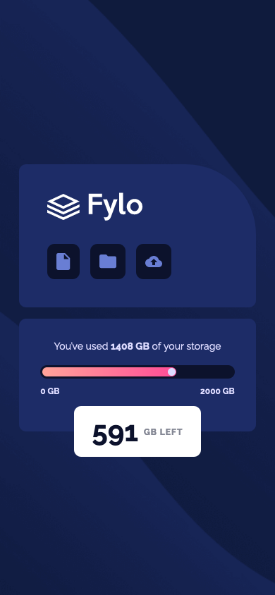
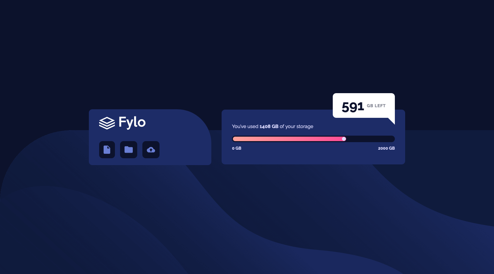

# Frontend Mentor - Fylo data storage component solution

This is a solution to the [Fylo data storage component challenge on Frontend Mentor](https://www.frontendmentor.io/challenges/fylo-data-storage-component-1dZPRbV5n). Frontend Mentor challenges help you improve your coding skills by building realistic projects. 

## Table of contents

- [Overview](#overview)
  - [The challenge](#the-challenge)
  - [Screenshot](#screenshot)
  - [Links](#links)
- [My process](#my-process)
  - [Built with](#built-with)
  - [What I learned](#what-i-learned)
  - [Useful resources](#useful-resources)
- [Author](#author)

**Note: Delete this note and update the table of contents based on what sections you keep.**

## Overview

### The challenge

Users should be able to:

- View the optimal layout for the site depending on their device's screen size

### Screenshot





### Links

- Solution URL: [https://github.com/Rod-Barbosa/fylo-data-storage-component](https://github.com/Rod-Barbosa/fylo-data-storage-component)
- Live Site URL: [Add live site URL here](https://your-live-site-url.com)

## My process

### Built with

- Semantic HTML5 markup
- CSS custom properties
- CSS Grid
- Mobile-first workflow
- Typescript/Query selectors


### What I learned


This is a nice trick for centering elements in a way that make them pop. Position absolute left 50%, followed by position relative left -50%
```css
.floating-msg-container {
    position: absolute;
    left: 50%;
    top: 78%
}

.msg {
    background-color: white;
    padding: 1.2rem 2.6rem;
    display: flex;
    flex-direction: row;
    align-items: center;
    justify-content: center;
    border-radius: 1rem;
    position: relative;
    left: -50%;
}
```

This function is elegant and makes the progress bar always proportional, instead of a hard coded value.
The hardest part was remembering to add:
 .toString() + '%'
when creating the dynamic with property for progress bar
```js
const progressBar = document.querySelector('.progress-bar-color');
progressBar.style.width = (usedStorage/maxStorage*100).toString() + '%'
```

Basic variables in css and easy to screw up gradient property for background (not background-color)
```css
:root{
    --gradient-1: hsl(6, 100%, 80%);
    --gradient-2: hsl(335, 100%, 65%);
    --pale-blue: hsl(243, 100%, 93%);
    --grayish-blue: hsl(229, 7%, 55%);
    --dark-blue: hsl(228, 56%, 26%);
    --very-dark-blue: hsl(229, 57%, 11%);
}
    background: linear-gradient(to right, var(--gradient-1),var(--gradient-2));

```


### Useful resources

- [CSS variables](https://www.w3schools.com/css/css3_variables.asp) - Pretty much the basics 

## Author

- Website - [Rodrigo](https://www.gelatodigital.com)
- Frontend Mentor - [@Rod-Barbosa](https://www.frontendmentor.io/profile/Rod-Barbosa)
